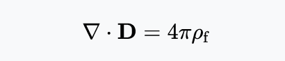
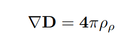
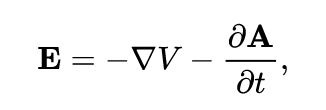
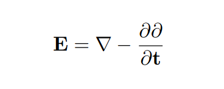

# Image2Latex-OCR

Trained CRNN that outputs LaTeX source text given an input image.

Evaluated on IM2LATEX-100K test images of less than 641x100 px (WxH); averaged a **0.48 BLEU-4** score and edit distance of **56**.

Within the `src` directory, run the model with
``
  python main.py
    --path <path_to_images>
    --model <path_to_model_parameters>
``.
Alternatively, to view images, run ``main.ipynb``. If optional parameters are excluded, images and model parameters are assumed to be in ``../images`` and ``../saved/params/CRNN_params_epoch3``.

## Examples:
### *Gauss's law, differential form (https://en.wikipedia.org/wiki/Maxwell%27s_equations)*

Source: `\nabla \cdot \bf D = 4 \pi \rho_f`

Prediction: `'{ \nabla { \bf D = 4 \pi \rho _ { \rho { '`

Cleaning up brackets:

### *Rewriting electric field (https://en.wikipedia.org/wiki/Electric_potential)*

Source: `\bf E = - \nabla V - \frac{ \partial \bf A }{ \partial t } ,`

Prediction: `{ \bf E } = \nabla - \frac { \partial { \partial } { \partial t } , { '`

Cleaning up brackets:

